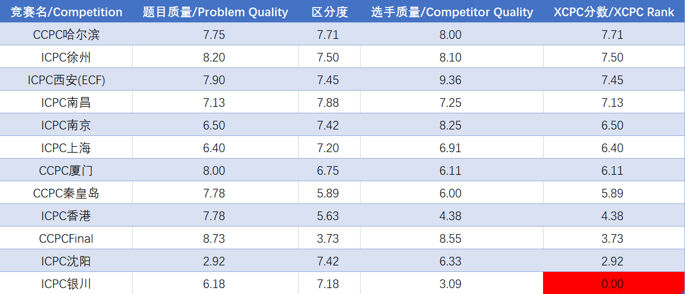

## \*CPC Rank

### What's this?
As the description told, **xcpc-rank** provides a score based on the quality of the competitive programming contest in Mainland China. If you want to know more, please visit [here](https://zhuanlan.zhihu.com/p/81155749) (in Chinese).

### 这是什么？
\*CPC Rank （读法是 XCPC Rank）是我一个突发奇想的自嗨计划，是一个为本年度在中国大陆地区举行的 ICPC 或 CCPC 赛事评分并排行的计划。你可以在[这里](https://zhuanlan.zhihu.com/p/81155749)看到对该项计划的完整描述。

### How to read it?

### 怎么看表格分数？
我将一场比赛的评分分为三个维度：【题目质量】、【区分度】以及【选手质量】。

分数上，1 分代表“在区域赛水平下”能达到的最低水平，因此 1 分代表着两种可能：确实在区域赛水平下的最低水平，或根本达不到区域赛要求。

10分类似，表示的是最高水平。这有助于你理解分数高低的差距。

### How you score these competitions?

### 你是怎么给出这些评分的？
请参考上面的链接。简单的说，我邀请了一批我认为专业的选手或裁判进行评分，同时我本人不进行评分。

## 2019 Results / 2019 年度评分结果

